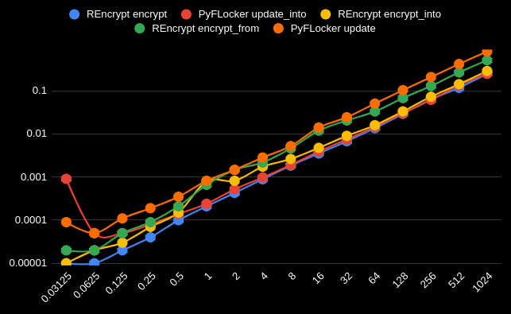
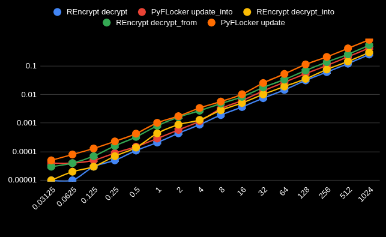
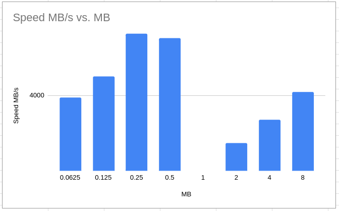

# REncrypt

A Python encryption library implemented in Rust. It supports `AEAD` with `AES-GCM` and `ChaCha20Poly1305`. It uses [ring](https://crates.io/crates/ring) to handle encryption.  
If offers slightly higher speed compared to other Python libs. The API tries to be easy to use but it's more optimized for speed.

So if you want to achieve the highest possible encryption speed, consider giving it a try.

# Benchmark

Some benchmarks comparing to [PyFLocker](https://github.com/arunanshub/pyflocker), which, from other implementations, I found to be the fastest. After this there is also comparison with other implementations.

## Buffer in memory

This is useful when you keep a buffer, set your plaintext/ciphertext in there, and then encrypt/decrypt in-place that buffer. This is the most performant way to use it, because it doesn't allocate new memory.  
`REncrypt` is faster on small buffers, less than few MB, `PyFLocker` is comming closer for larger buffers.

| Encrypt | Decrypt |
| ------- | ------- |
|  |  |


<table>
    <thead>
        <tr>
            <th rowspan=2>MB</th>
            <th colspan=2>Encrypt seconds</th>
            <th colspan=2>Decrypt seconds</th>
        </tr>
        <tr>
            <th>REncrypt</th>
            <th>PyFLocker</th>
            <th>REncrypt</th>
            <th>PyFLocker</th>
        </tr>
    </thead>
    <tbody>
        <tr>
            <td>0.03125</td>
            <td>0.00001</td>
            <td>0.00091</td>
            <td>0.00001</td>
            <td>0.00004</td>
        </tr>
        <tr>
            <td>0.0625</td>
            <td>0.00001</td>
            <td>0.00005</td>
            <td>0.00001</td>
            <td>0.00004</td>
        </tr>
        <tr>
            <td>0.125</td>
            <td>0.00002</td>
            <td>0.00005</td>
            <td>0.00003</td>
            <td>0.00005</td>
        </tr>
        <tr>
            <td>0.25</td>
            <td>0.00004</td>
            <td>0.00008</td>
            <td>0.00005</td>
            <td>0.00009</td>
        </tr>
        <tr>
            <td>0.5</td>
            <td>0.00010</td>
            <td>0.00014</td>
            <td>0.00011</td>
            <td>0.00015</td>
        </tr>
        <tr>
            <td>1</td>
            <td>0.00021</td>
            <td>0.00024</td>
            <td>0.00021</td>
            <td>0.00029</td>
        </tr>
        <tr>
            <td>2</td>
            <td>0.00043</td>
            <td>0.00052</td>
            <td>0.00044</td>
            <td>0.00058</td>
        </tr>
        <tr>
            <td>4</td>
            <td>0.00089</td>
            <td>0.00098</td>
            <td>0.00089</td>
            <td>0.00117</td>
        </tr>
        <tr>
            <td>8</td>
            <td>0.00184</td>
            <td>0.00190</td>
            <td>0.00192</td>
            <td>0.00323</td>
        </tr>
        <tr>
            <td>16</td>
            <td>0.00353</td>
            <td>0.00393</td>
            <td>0.00367</td>
            <td>0.00617</td>
        </tr>
        <tr>
            <td>32</td>
            <td>0.00678</td>
            <td>0.00748</td>
            <td>0.00749</td>
            <td>0.01348</td>
        </tr>
        <tr>
            <td>64</td>
            <td>0.01361</td>
            <td>0.01461</td>
            <td>0.01460</td>
            <td>0.02697</td>
        </tr>
        <tr>
            <td>128</td>
            <td>0.02923</td>
            <td>0.03027</td>
            <td>0.03134</td>
            <td>0.05410</td>
        </tr>
        <tr>
            <td>256</td>
            <td>0.06348</td>
            <td>0.06188</td>
            <td>0.06136</td>
            <td>0.10417</td>
        </tr>
        <tr>
            <td>512</td>
            <td>0.11782</td>
            <td>0.13463</td>
            <td>0.12090</td>
            <td>0.21114</td>
        </tr>
        <tr>
            <td>1024</td>
            <td>0.25001</td>
            <td>0.24953</td>
            <td>0.25377</td>
            <td>0.42581</td>
        </tr>
    </tbody>
</table>


## File

<table>
    <thead>
        <tr>
            <th rowspan=2>MB</th>
            <th colspan=2>Encrypt<br>sec</th>
            <th colspan=2>Decrypt<br>sec</th>
        </tr>
        <tr>
            <th>REncrypt</th>
            <th>PyFLocker</th>
            <th>REncrypt</th>
            <th>PyFLocker</th>
        </tr>
    </thead>
    <tbody>
        <tr>
            <td>938.2</td>
            <td>0.69383</td>
            <td>0.76638</td>
            <td>0.67983</td>
            <td>0.93099</td>
        </tr>
    </tbody>
</table>

# Usage

There are three ways in which you can use the lib, the main difference is the speed, some offers an easier way to use it sacrificing performance.

1. **With a buffer in memory**: using `encrypt()`/`decrypt()`, is useful when you keep a buffer (or have it from somewhere), set your plaintext/ciphertext in there, and then encrypt/decrypt in-place that buffer. This is the most performant way to use it, because it doesn't copy the data nor it allocates new memory. If you can somehow directly collect the data to that buffer, like `file.read_into()`, **this is the preffered way to go**.
2. **From some bytes to the buffer**: using `encrypt_into_buf()`/`decrypt_to_buf()`, when you have some arbitrary bytes that you want to work with. You will first copy those bytes to the buffer then do the operation in-place in buffer. This is a bit slower, especially for large bytes, because it needs to copy the bytes to the buffer.
3. **From some bytes to another new bytes**: using `encrypt_from()`/`decrypt_from()`, tit doesn't use the buffer at all, you just got some bytes you want to work with and you receive back another new bytes. This is the slowest one because it needs to first allocate a buffer, copy the bytes to a buffer, perform the operation then return that buffer as bytes. It's the easiest to use but is not so performant.

# Examples

You can see more in [examples](https://github.com/radumarias/rencrypt-python/tree/main/examples) directory and in [bench.py](https://github.com/radumarias/rencrypt-python/tree/main/bench.py) which has some benchmarks. Here are few simple examples:

## Encrypt and decrypt with a buffer in memory

This is the most performant way to use it as it will not copy bytes to the buffer nor allocate new memory for plaintext and ciphertext.

```python
from rencrypt import REncrypt, Cipher
import os

# You can use also other ciphers like `cipher = Cipher.ChaCha20Poly1305`.
cipher = Cipher.AES256GCM
key = cipher.generate_key()
enc = REncrypt(cipher, key)

# we get a buffer based on block len 4096 plaintext
# the actual buffer will be 28 bytes larger as in ciphertext we also include the tag and nonce
plaintext_len, ciphertext_len, buf = enc.create_buf(4096)
aad = b"AAD"

# put some plaintext in the buffer, it would be ideal if you can directly collect the data into the buffer without allocating new memory
# but for the sake of example we will allocate and copy the data
plaintext = os.urandom(plaintext_len)
# enc.copy_slice is slighlty faster than buf[:plaintext_len] = plaintext, especially for large plaintext, because it copies the data in parallel
enc.copy_slice(plaintext, buf)
 # encrypt it, this will encrypt in-place the data in the buffer
 print("encryping...")
ciphertext_len = enc.encrypt(buf, plaintext_len, 42, aad)
cipertext = buf[:ciphertext_len]
# you can do something with the ciphertext

# decrypt it
# if you need to copy ciphertext to buffer, we don't need to do it now as it's already in the buffer
# enc.copy_slice(ciphertext, buf[:len(ciphertext)])
print("decryping...")
plaintext_len = enc.decrypt(buf, ciphertext_len, 42, aad)
plaintext2 = buf[:plaintext_len]
assert plaintext == plaintext2
print("bye!")
```

You can use other ciphers like `cipher = Cipher.ChaCha20Poly1305`.

## Encrypt and decrypt a file

It encrypts and decrypts the file in parallel.

```python
from rencrypt import REncrypt, Cipher
import hashlib

def calculate_file_hash(file_path):
    hash_algo = hashlib.sha256()
    with open(file_path, "rb") as f:
        for chunk in iter(lambda: f.read(4096), b""):
            hash_algo.update(chunk)
    return hash_algo.hexdigest()


def compare_files_by_hash(file1, file2):
    return calculate_file_hash(file1) == calculate_file_hash(file2)

file_in = "/tmp/fin"
file_out = "/tmp/fout.enc"

# You can use also other ciphers like `cipher = Cipher.ChaCha20Poly1305`.
cipher = Cipher.AES256GCM
key = cipher.generate_key()
enc = REncrypt(cipher, key)

aad = b"AAD"

# encrypt it
print("encryping...")
enc.encrypt_file(file_in, file_out, aad)

# decrypt it
print("decryping...")
enc.decrypt_file(file_out, file_in, aad)

compare_files_by_hash(file_in, file_out)
print("bye!")
```

Currently it's not possible to encrypt/decrypt to the same file. **DON'T DO IT, IT WILL COMPROMISE THE FILE**.

## Encrypt and decrypt from some bytes to the buffer

This is a bit slower than handling data only via the buffer, especially for large plaintext, but there are situations when you can't directly collect the data to the buffer but have some bytes from somewhere else.

```python
from rencrypt import REncrypt, Cipher
import os

# You can use also other ciphers like `cipher = Cipher.ChaCha20Poly1305`.
cipher = Cipher.AES256GCM
key = cipher.generate_key()
enc = REncrypt(cipher, key)

# we get a buffer based on block len 4096 plaintext
# the actual buffer will be 28 bytes larger as in ciphertext we also include the tag and nonce
plaintext_len, ciphertext_len, buf = enc.create_buf(4096)
aad = b"AAD"

plaintext = bytes(os.urandom(plaintext_len))

 # encrypt it, after this will have the ciphertext in the buffer
 print("encryping...")
ciphertext_len = enc.encrypt_into_buf(plaintext, buf, 42, aad)
cipertext = bytes(buf[:ciphertext_len])

# decrypt it
print("decryping...")
plaintext_len = enc.decrypt_into_buf(cipertext, buf, 42, aad)
plaintext2 = buf[:plaintext_len]
assert plaintext == plaintext2
print("bye!")
```

## Encrypt and decrypt from some bytes to another new bytes, without using the buffer

This is the slowest option, especially for large plaintext, because it allocates new memory for the ciphertext on encrypt and plaintext on decrypt.

```python
from rencrypt import REncrypt, Cipher
import os

# You can use also other ciphers like `cipher = Cipher.ChaCha20Poly1305`.# You can use also other ciphers like `cipher = Cipher.ChaCha20Poly1305`.
cipher = Cipher.AES256GCM
key = cipher.generate_key()
enc = REncrypt(cipher, key)

aad = b"AAD"

plaintext = os.urandom(4096)

 # encrypt it, this will return the ciphertext
 print("encryping...")
ciphertext = enc.encrypt_from(plaintext, 42, aad)

# decrypt it
print("decryping...")
plaintext2 = enc.decrypt_from(ciphertext, 42, aad)
assert plaintext == plaintext2
print("bye!")
```
# Building from source

## Browser

[](https://gitpod.io/#https://github.com/radumarias/rencrypt-python)

[](https://github.com/codespaces/new/?repo=radumarias%2Frencrypt-python&ref=main)

## Geting sources from GitHub

```bash
git clone https://github.com/radumarias/rencrypt-python && cd rencrypt-python
```

## Compile and run

```bash
curl --proto '=https' --tlsv1.2 -sSf https://sh.rustup.rs | sh
```
To configure your current shell, you need to source
the corresponding env file under $HOME/.cargo.
This is usually done by running one of the following (note the leading DOT):
```bash
. "$HOME/.cargo/env"
```
```
python -m venv .env
source .env/bin/activate
pip install maturin
maturin develop
python python bench.py
```

# More benchmarks

## Different ways to use the lib

| Encrypt | Decrypt |
| ------- | ------- |
|  |  |


<table>
    <thead>
        <tr>
            <th rowspan=2>MB</th>
            <th colspan=5>Encrypt seconds</th>
            <th colspan=5>Decrypt seconds</th>
        </tr>
        <tr>
            <th>REncrypt<br>encrypt</th>
            <th>PyFLocker<br>update_into</th>
            <th>REncrypt<br>encrypt_into_buf</th>
            <th>REncrypt<br>encrypt_from</th>
            <th>PyFLocker<br>update</th>
            <th>REncrypt<br>decrypt</th>
            <th>PyFLocker<br>update_into</th>
            <th>REncrypt<br>decrypt_into_buf</th>
            <th>REncrypt<br>decrypt_from</th>
            <th>PyFLocker<br>update</th>
        </tr>
    </thead>
    <tbody>
        <tr>
            <td>0.03125</td>
            <td>0.00001</td>
            <td>0.00091</td>
            <td>0.00001</td>
            <td>0.00002</td>
            <td>0.00009</td>
            <td>0.00001</td>
            <td>0.00004</td>
            <td>0.00001</td>
            <td>0.00003</td>
            <td>0.00005</td>
        </tr>
        <tr>
            <td>0.0625</td>
            <td>0.00001</td>
            <td>0.00005</td>
            <td>0.00002</td>
            <td>0.00002</td>
            <td>0.00005</td>
            <td>0.00001</td>
            <td>0.00004</td>
            <td>0.00002</td>
            <td>0.00004</td>
            <td>0.00008</td>
        </tr>
        <tr>
            <td>0.125</td>
            <td>0.00002</td>
            <td>0.00005</td>
            <td>0.00003</td>
            <td>0.00005</td>
            <td>0.00011</td>
            <td>0.00003</td>
            <td>0.00005</td>
            <td>0.00003</td>
            <td>0.00007</td>
            <td>0.00013</td>
        </tr>
        <tr>
            <td>0.25</td>
            <td>0.00004</td>
            <td>0.00008</td>
            <td>0.00007</td>
            <td>0.00009</td>
            <td>0.00019</td>
            <td>0.00005</td>
            <td>0.00009</td>
            <td>0.00007</td>
            <td>0.00016</td>
            <td>0.00023</td>
        </tr>
        <tr>
            <td>0.5</td>
            <td>0.00010</td>
            <td>0.00014</td>
            <td>0.00015</td>
            <td>0.00021</td>
            <td>0.00035</td>
            <td>0.00011</td>
            <td>0.00015</td>
            <td>0.00014</td>
            <td>0.00033</td>
            <td>0.00043</td>
        </tr>
        <tr>
            <td>1</td>
            <td>0.00021</td>
            <td>0.00024</td>
            <td>0.00080</td>
            <td>0.00066</td>
            <td>0.00082</td>
            <td>0.00021</td>
            <td>0.00029</td>
            <td>0.00044</td>
            <td>0.00081</td>
            <td>0.00103</td>
        </tr>
        <tr>
            <td>2</td>
            <td>0.00043</td>
            <td>0.00052</td>
            <td>0.00082</td>
            <td>0.00147</td>
            <td>0.00147</td>
            <td>0.00044</td>
            <td>0.00058</td>
            <td>0.00089</td>
            <td>0.00162</td>
            <td>0.00176</td>
        </tr>
        <tr>
            <td>4</td>
            <td>0.00089</td>
            <td>0.00098</td>
            <td>0.00174</td>
            <td>0.00218</td>
            <td>0.00284</td>
            <td>0.00089</td>
            <td>0.00117</td>
            <td>0.00130</td>
            <td>0.00273</td>
            <td>0.00340</td>
        </tr>
        <tr>
            <td>8</td>
            <td>0.00184</td>
            <td>0.00190</td>
            <td>0.00263</td>
            <td>0.00462</td>
            <td>0.00523</td>
            <td>0.00192</td>
            <td>0.00323</td>
            <td>0.00283</td>
            <td>0.00484</td>
            <td>0.00571</td>
        </tr>
        <tr>
            <td>16</td>
            <td>0.00353</td>
            <td>0.00393</td>
            <td>0.00476</td>
            <td>0.01196</td>
            <td>0.01410</td>
            <td>0.00367</td>
            <td>0.00617</td>
            <td>0.00509</td>
            <td>0.00834</td>
            <td>0.01031</td>
        </tr>
        <tr>
            <td>32</td>
            <td>0.00678</td>
            <td>0.00748</td>
            <td>0.00904</td>
            <td>0.02051</td>
            <td>0.02440</td>
            <td>0.00749</td>
            <td>0.01348</td>
            <td>0.01014</td>
            <td>0.01780</td>
            <td>0.02543</td>
        </tr>
        <tr>
            <td>64</td>
            <td>0.01361</td>
            <td>0.01461</td>
            <td>0.01595</td>
            <td>0.03323</td>
            <td>0.05064</td>
            <td>0.01460</td>
            <td>0.02697</td>
            <td>0.01920</td>
            <td>0.03355</td>
            <td>0.05296</td>
        </tr>
        <tr>
            <td>128</td>
            <td>0.02923</td>
            <td>0.03027</td>
            <td>0.03343</td>
            <td>0.06805</td>
            <td>0.10362</td>
            <td>0.03134</td>
            <td>0.05410</td>
            <td>0.03558</td>
            <td>0.06955</td>
            <td>0.11380</td>
        </tr>
        <tr>
            <td>256</td>
            <td>0.06348</td>
            <td>0.06188</td>
            <td>0.07303</td>
            <td>0.13003</td>
            <td>0.20911</td>
            <td>0.06136</td>
            <td>0.10417</td>
            <td>0.07572</td>
            <td>0.13733</td>
            <td>0.20828</td>
        </tr>
        <tr>
            <td>512</td>
            <td>0.11782</td>
            <td>0.13463</td>
            <td>0.14283</td>
            <td>0.26799</td>
            <td>0.41929</td>
            <td>0.12090</td>
            <td>0.21114</td>
            <td>0.14434</td>
            <td>0.25771</td>
            <td>0.41463</td>
        </tr>
        <tr>
            <td>1024</td>
            <td>0.25001</td>
            <td>0.24953</td>
            <td>0.28912</td>
            <td>0.51228</td>
            <td>0.82370</td>
            <td>0.25377</td>
            <td>0.42581</td>
            <td>0.29795</td>
            <td>0.53807</td>
            <td>0.82588</td>
        </tr>
    </tbody>
</table>

## Speed throughput

`128KB` seems to be the optimal byffer size that offers the max `MB/s` speed for encryption, on benchmarks that seem to be the case.
We performed `10.000` encryption operations for each size varying from `64KB` to `1GB`, after `8MB` it tops up to similar values.



| MB    | Speed MB/s |
| ----- | ------- |
| 0.0625 | 4208 |
| <span style="color: red; font-weight: bold;">0.125</span> | <span style="color: red; font-weight: bold;">4479</span> |
| 0.25 | 4223 |
| 0.5 | 4331 |
| 1.0 | 3579 |
| 2.0 | 3664 |
| 4.0 | 3446 |
| 8.0 | 3880 |

# For the future

- Add more `AES` ciphers like `AES128-GCM` and `AES-GCM-SIV`
- Ability to use other crates to handle encryption like [RustCrypto](https://github.com/RustCrypto/traits)
- Maybe add support for `RSA` and `Elliptic-curve cryptography`
- Saving and loading keys from file

# Considerations

This lib hasn't been audited, but it mostly wraps `ring` crate which is a well known library, so in principle it should offer the same level of security.
